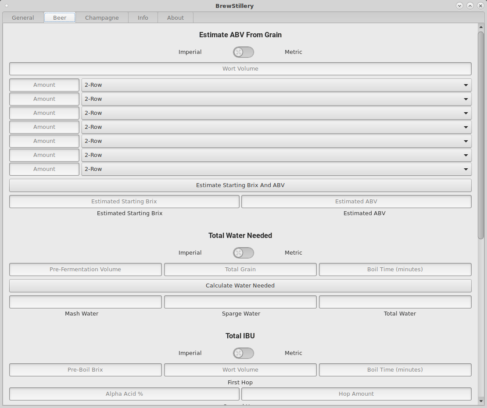
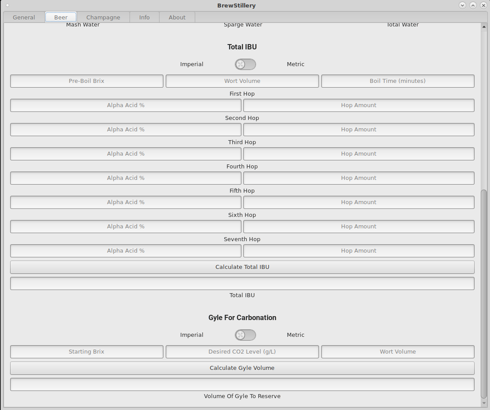

# BrewStillery
BrewStillery is a brewer's, vintner's, and distiller's calculator.
It has a multitude of great functions, such as calculating ABV, determining carbonation, and total sparge water needed.

Written in Rust, using GTK3

## New In 5.0.0
  * MASSIVE overhaul!!! Hence the jump from Version 3.0.0 to 5.0.0.
  * Huge code cleanup: removed tons of unneeded borrows and things of that nature.
  * Created a complete theme with CSS and images.
  * Switched from a GtkWindow to a GtkApplicationWindow, which allows us to have proper domain naming.
  * Added finished beer colour output:
    * To calculate what the finished beer will look like, the flow goes like this:
        * Individual grains go through singleMCU, those are added up and passed into beerSRM, and that gives us a total SRM value.
        * We then convert that SRM value to L\*ab, from L\*ab to XYZ, and finally to RGBA.
        * That gives us the colour you would expect to see.
    * Also, because of the diameter of a glass, larger vessels will make beer appear darker. So, we accounted for that with standard glassware and averaged lighting data.
        * We now have a dropdown menu where you can pick your glassware and it will show you the appropriate colour in that glass.
  * Switched from an entry/button setup to a dynamic one: everything is calculated on the fly.
  * Refactored our ABV functions. It's now based off of one source, which is very accurate.
  * Changed from using 32 bit floating point to 64 bit


## Screenshots:







## To Do:
  * Update Screenshots
  * Add Documentation To The Info Tab
  * Add Sugars And Fruits To ABV From Grain
  * Add Water Minerals Calculator
  * Add Export To Gourmet Option


## Building:
  To install on Arch, the AUR package name is ```brewstillery```.

  To build, just run ```cargo build --release```. The resultant binary will be ```target/release/BrewStillery```.

  To install/uninstall system-wide, run ```install.sh``` or ```uninstall.sh``` from the scripts directory.

  If you're installing with ```cargo install BrewStillery```, the logo image will be missing.

  To fix this, you will need ```BrewStilleryLogo.svg``` from the media directory.

  Install it with ```sudo install -Dm755 ../media/BrewStilleryLogo.svg /usr/share/BrewStillery/BrewStilleryLogo.svg```


## Sources:
  * ["Brew By Numbers - Add Up What's In Your Beer"](https://www.homebrewersassociation.org/attachments/0000/2497/Math_in_Mash_SummerZym95.pdf) - Michael L. Hall. PH.D., Zymurgy (Summer) 1995
  * ["Refractometer FG Results « SeanTerrill.com"](http://seanterrill.com/2011/04/07/refractometer-fg-results/) - SeanTerrill.com, Modified: January 2010
  * ["Kraeusening"](http://www.braukaiser.com/wiki/index.php?title=Kraeusening) - Braukaiser.com, Modified: January 2, 2010
  * ["Glenn Tinseth's Hop Page"](http://realbeer.com/hops/) - Glenn Tinseth, 1995-1999
  * ["Calculating Gravity, Bitterness, And Color: Techniques"](https://byo.com/bock/item/409-calculating-gravity-bitterness-and-color-techniques) - Chris Colby, 2000
  * ["Formulas And C Source Code"](https://web.archive.org/web/20090807084643/http://www.primetab.com:80/formulas) - PrimeTab, Modified: March 25, 2002
  * ["Estimating Color"](http://brewwiki.com/index.php/Estimating_Color) - BrewWiki.com, Modified: May, 17 2008
  * ["Technical Information for Brewers"](http://wetnewf.org/pdfs/Brewing_articles/MOAWorkbook.xls) - A.J. deLange, 2013
  * ["Color math and programming code examples"](https://www.easyrgb.com/en/math.php) - IRO Group Limited, 2018