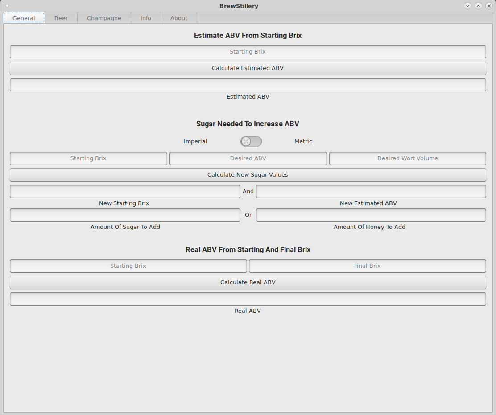
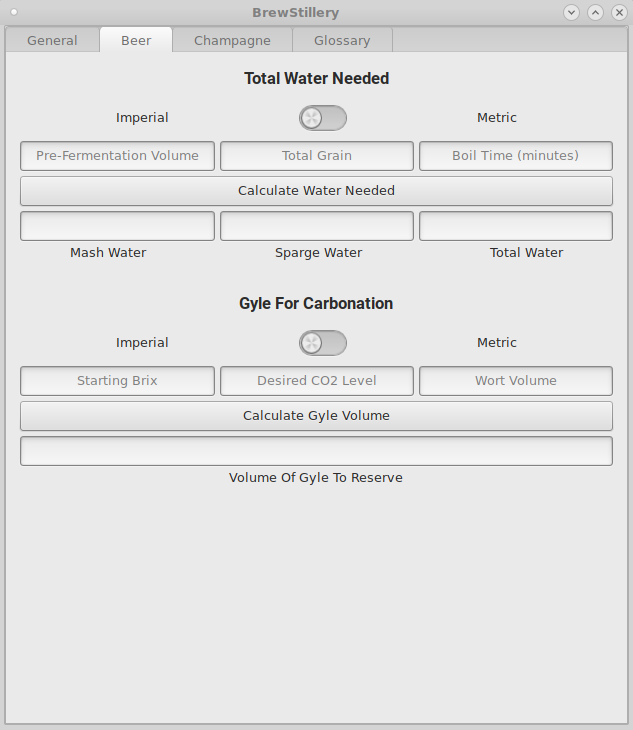
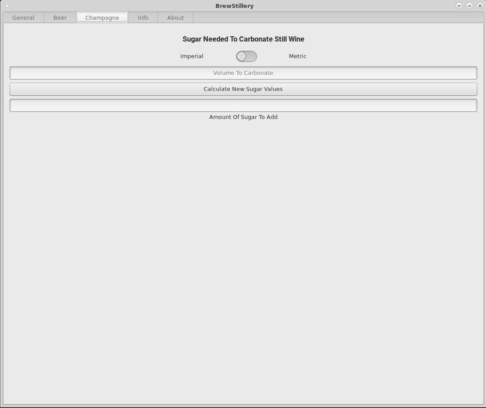

# BrewStillery
BrewStillery is a brewer's, vintner's, and distiller's calculator.
It has a multitude of great functions, such as calculating ABV, determining carbonation, and total sparge water needed.

Written in Rust, using GTK3


## Screenshots:







## To Do:
  * IBU
  * Grain


## Building:
  In Cargo.toml, set ```codegen-units``` to however many cores you want to use to compile.

  To build, just run ```cargo build --release```. The resultant binary will be ```target/release/BrewStillery```.

  To install/uninstall system-wide, run ```install.sh``` or ```uninstall.sh``` from the scripts directory.

  If you're installing with ```cargo install BrewStillery```, the logo image will be missing.

  To fix this, you will need ```BrewStilleryLogo.svg``` from the media directory.

  Install it with ```sudo install -Dm755 ../media/BrewStilleryLogo.svg /usr/share/BrewStillery/BrewStilleryLogo.svg```


## Sources:
  * ["Brew By Numbers - Add Up What's In Your Beer"](https://www.homebrewersassociation.org/attachments/0000/2497/Math_in_Mash_SummerZym95.pdf) - Michael L. Hall. PH.D., Zymurgy (Summer) 1995
  * ["Kraeusening"](http://www.braukaiser.com/wiki/index.php?title=Kraeusening) - Braukaiser.com, Modified: January 2, 2010