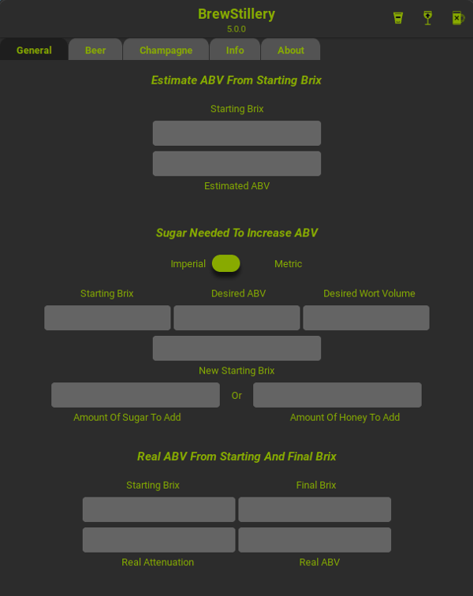
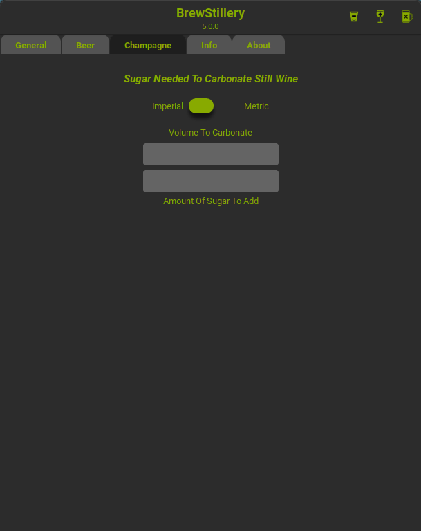

# BrewStillery
BrewStillery is a brewer's, vintner's, and distiller's calculator.
It has a multitude of great functions, such as calculating ABV, determining carbonation, and total sparge water needed.

Written in Rust, using GTK3

## New In 3.0.0
Added the grain calculator to the beer tab.
Reworked the maths in the RealABV calculator, because it was completely inaccurate.
Reworked the graphical layout as well.


## Screenshots:






## To Do:
  * Water Minerals
  * Export To Gourmet


## Building:
  To install on Arch, the AUR package name is ```brewstillery```.

  In Cargo.toml, set ```codegen-units``` to however many cores you want to use to compile.

  To build, just run ```cargo build --release```. The resultant binary will be ```target/release/BrewStillery```.

  To install/uninstall system-wide, run ```install.sh``` or ```uninstall.sh``` from the scripts directory.

  If you're installing with ```cargo install BrewStillery```, the logo image will be missing.

  To fix this, you will need ```BrewStilleryLogo.svg``` from the media directory.

  Install it with ```sudo install -Dm755 ../media/BrewStilleryLogo.svg /usr/share/BrewStillery/BrewStilleryLogo.svg```


## Sources:
  * ["Brew By Numbers - Add Up What's In Your Beer"](https://www.homebrewersassociation.org/attachments/0000/2497/Math_in_Mash_SummerZym95.pdf) - Michael L. Hall. PH.D., Zymurgy (Summer) 1995
  * ["Kraeusening"](http://www.braukaiser.com/wiki/index.php?title=Kraeusening) - Braukaiser.com, Modified: January 2, 2010
  * ["Glenn Tinseth's Hop Page"](http://realbeer.com/hops/) - Glenn Tinseth, 1995-1999
  * ["Calculating Gravity, Bitterness, And Color: Techniques"](https://byo.com/bock/item/409-calculating-gravity-bitterness-and-color-techniques) - Glenn Tinseth, 1995-1999
  * ["Formulas And C Source Code"](https://web.archive.org/web/20090807084643/http://www.primetab.com:80/formulas) - PrimeTab, Modified: March 25, 2002